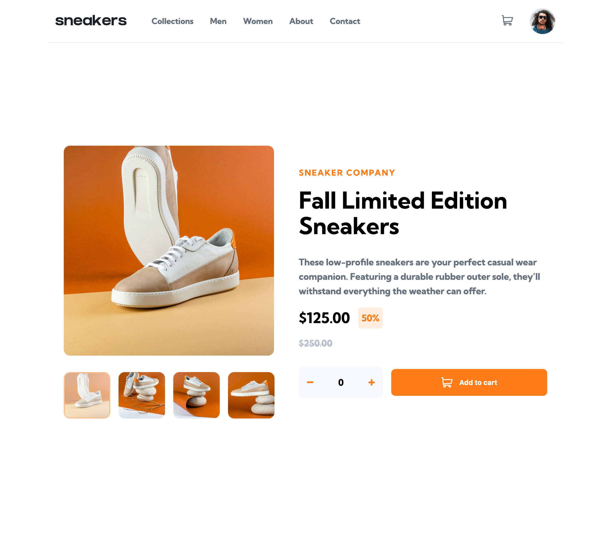
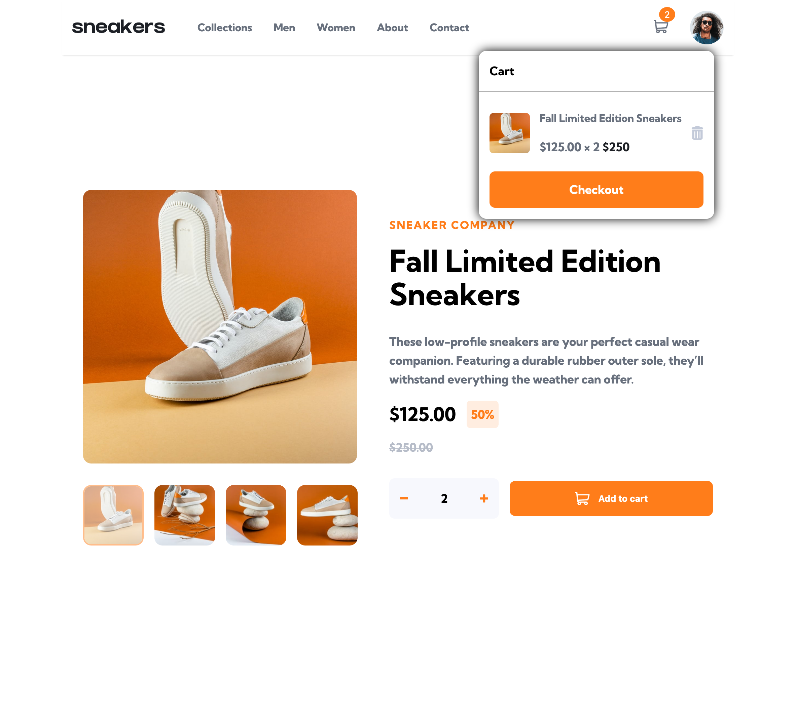
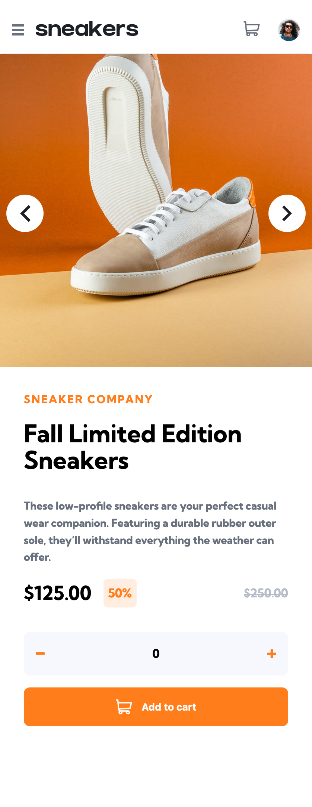
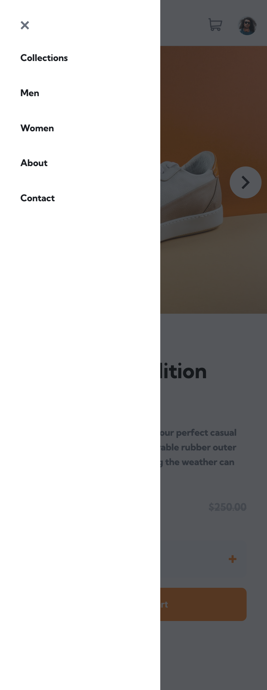

## Table of contents

- [Table of contents](#table-of-contents)
- [Overview](#overview)
  - [The challenge](#the-challenge)
  - [Screenshots](#screenshots)
  - [Links](#links)
- [My process](#my-process)
  - [Tech Stack](#tech-stack)

## Overview

### The challenge

Users should be able to:

- View the optimal layout for the site depending on their device's screen size
- See hover states for all interactive elements on the page
- Open a lightbox gallery by clicking on the large product image
- Switch the large product image by clicking on the small thumbnail images
- Add items to the cart
- View the cart and remove items from it

### Screenshots

### Links

- Solution URL: [https://github.com/andrewteece/ecommerce-product-page](https://your-solution-url.com)
- Live Site URL: [https://andrewteece.github.io/ecommerce-product-page/](https://your-live-site-url.com)

## My process

### Tech Stack

- Semantic HTML5 markup
- CSS custom properties
- Flexbox
- JavaScript

